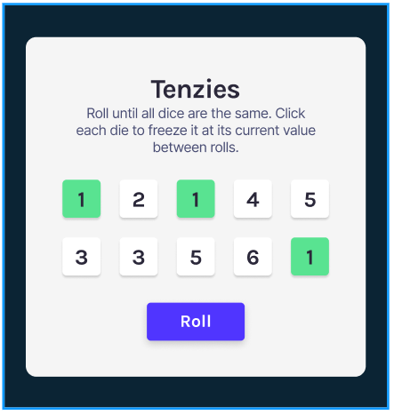

Tenzies is a fun and interactive dice game built using React. The goal is to roll the dice until all of them show the same value. Players can click on individual dice to freeze their values, and only unfrozen dice will roll in subsequent turns. This project demonstrates the use of essential React concepts, including state management, props, conditional rendering, and hooks.

The application is designed with a user-friendly interface and showcases React's capabilities in building dynamic, responsive applications. Perfect for learning and practicing React fundamentals while having some fun!

